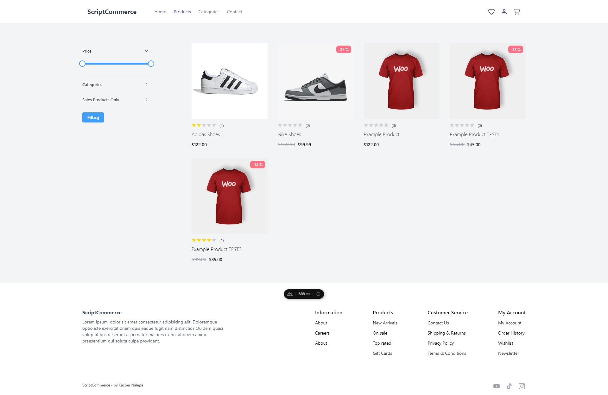
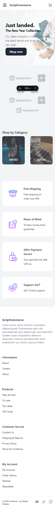
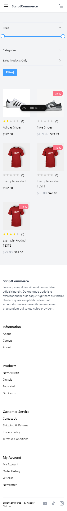

<h1 align="center">Vue Shop/ScriptCommerce</h1>

  

## Project Overview 🎉

## Tech/framework used 🔧

<h3>Frontend</h3>
<ul>
    <li>Vue 3</li>
    <li>Nuxt 3</li>
    <li>Tailwind</li>
    <li>SCSS</li>
    <li><a href="https://pinia.vuejs.org/" target="_blank">Pinia</a></li>
    <li><a href="https://i18n.nuxtjs.org/" target="_blank">i18n</a></li>
    <li><a href="https://www.npmjs.com/package/cookie-universal-nuxt" target="_blank">Cookie Universal - Nuxt</a></li>
    <li><a href="https://element-plus.org/en-US/" target="_blank">Element Plus - Vue UI</a></li>
    <li><a href="https://element-plus.org/en-US/" target="_blank">Vitest</a></li>
</ul>

 

<h3>Backend</h3>
<ul>
    <li>Node.js</li>
    <li>Strapi</li>
</ul>

## Screenshots 📺

<h3>Desktop</h3>

    

    

<h3>Mobile</h3>

    

    

## Code Example/Issues 🔍

## Installation 💾

Frontend:
When you clone whole project, you have to go to '/client' path and run
`npm install`

If you want to start working on project, you have to run:
`npm run dev`
and go to the http://localhost:3000/

Backend:
As a FE Developer, I don't have a huge experience with BE, so I reduce it as possible, but I had to implement something, so if you want to start your BE envirnament, you have to go to the '/api' path and run
`npm install`

It's not all, after installing alle required packages, you have to start your BE project, for that you can use:
`npm run start`

## Available scripts

| Command         | Description                    |     |
| --------------- | ------------------------------ | --- |
| `npm run start` | Open local server for backend  |     |
| `npm run build` | Build strapi/backlend server   |     |
| `npm run dev`   | Open local server for frontend |     |
| `npm run build` | Build nuxt app for prod        |     |

## Live 📍

not published yet

## License 🔱

I took this app design from here: <a href="https://woonuxt-v3.vercel.app/" target="_blank">click here</a>
